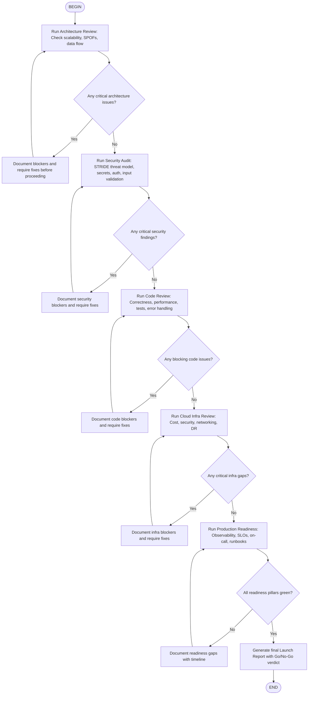

# Pre-Launch Checklist Flow

Runs through architecture, security, code, infrastructure, and operations in sequence.

```mermaid
flowchart TD
    A([BEGIN]) --> B[Run Architecture Review: Check scalability, SPOFs, data flow]
    B --> C{Any critical architecture issues?}
    C -->|Yes| D[Document blockers and require fixes before proceeding]
    D --> B
    C -->|No| E[Run Security Audit: STRIDE threat model, secrets, auth, input validation]
    E --> F{Any critical security findings?}
    F -->|Yes| G[Document security blockers and require fixes]
    G --> E
    F -->|No| H[Run Code Review: Correctness, performance, tests, error handling]
    H --> I{Any blocking code issues?}
    I -->|Yes| J[Document code blockers and require fixes]
    J --> H
    I -->|No| K[Run Cloud Infra Review: Cost, security, networking, DR]
    K --> L{Any critical infra gaps?}
    L -->|Yes| M[Document infra blockers and require fixes]
    M --> K
    L -->|No| N[Run Production Readiness: Observability, SLOs, on-call, runbooks]
    N --> O{All readiness pillars green?}
    O -->|No| P[Document readiness gaps with timeline]
    P --> N
    O -->|Yes| Q[Generate final Launch Report with Go/No-Go verdict]
    Q --> R([END])
```
